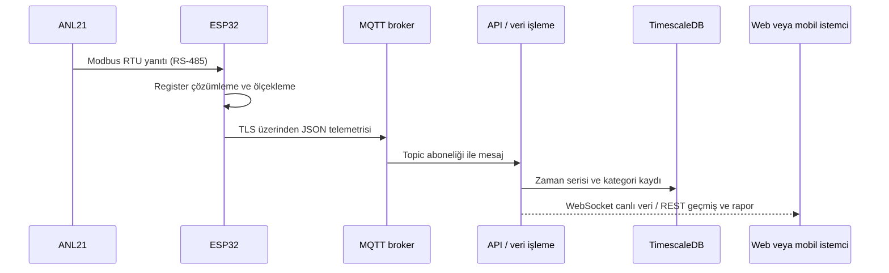

# ANL21 Tabanlı Üç Fazlı Elektrik Ölçümlerinin IoT Üzerinden Aktarımı ve İşletme Değerlendirmesi

**Teknik proje makalesi · 29 Eylül 2026**

## Öz

Bu makale, Grup Arge ANL21 güç analizöründen okunan üç fazlı elektriksel büyüklüklerin ESP32 tabanlı bir ağ geçidiyle uzaktaki bir sunucuya aktarılmasını ve bu ölçümlerin müşteriye yönelik izleme ve değerlendirme çıktısına dönüştürülmesini inceler. Sistem; RS-485/Modbus RTU, ESP32 firmware'i, MQTT üzerinden telemetri, FastAPI tabanlı uygulama sunucusu, PostgreSQL/TimescaleDB veri katmanı, WebSocket ve REST arayüzleri ile web ve mobil istemcilerden oluşur. Anlık ölçümler ile enerji sayaçları, talep (demand), minimum/maksimum değerler, harmonikler ve cihaz bilgileri ayrı mesaj ve veri kümeleri halinde ele alınır. Sunucu katmanı ham ölçümleri saklamanın yanında saatlik enerji, 15 dakikalık demand ve 10 dakikalık güç kalitesi özetleri üretir. Müşteriye canlı izleme, dönemsel tüketim, tarife etkisi, alarm özeti ve indirilebilir rapor sunulur.

Çalışmanın katkısı, ölçümün sahadaki cihazdan kullanıcı değerlendirmesine kadar izlenebilir bir veri akışı içinde ele alınması ve her dönüşüm katmanının sorumluluğunun açıklanmasıdır. Proje kayıtları ANL21 firmware'inin gerçek cihazda denenerek genişletildiğini ve web/mobil ekranlarının doğrulandığını bildirir. Bununla birlikte bu makalede kalibrasyon laboratuvarı karşılaştırması, ölçüm belirsizliği bütçesi veya uzun dönemli saha doğruluğu için nicel sonuç sunulmamaktadır. Bu nedenle sunulan güç kalitesi değerlendirmesi teknik izleme özelliği olarak yorumlanmalı; resmî uygunluk belgesi veya arıza teşhisi yerine kullanılmamalıdır. Yayın güvenliği amacıyla gerçek sunucu adresleri, kimlik bilgileri, müşteri verileri, cihaz seri numaraları ve kurulum sırları çıkarılmıştır.

**Anahtar kelimeler:** enerji izleme, güç analizörü, ESP32, Modbus RTU, MQTT, zaman serisi, güç kalitesi, müşteri raporlaması.

## 1. Giriş

Elektrik tüketiminin yalnızca dönem sonu sayaç endeksleriyle izlenmesi, kısa süreli talep tepelerini, fazlar arasındaki farklılıkları ve güç kalitesindeki zamana bağlı değişimleri açıklamakta yetersiz kalabilir. Üç fazlı bir analizör; gerilim, akım, aktif/reaktif/görünür güç, frekans, güç faktörü, enerji endeksleri ve harmonik göstergeleri gibi çok boyutlu verileri sağlar. Bu verinin işletme açısından kullanılabilmesi için ölçümün güvenilir biçimde okunması, aktarım sırasında cihaz ve veri türünün belirlenmesi, saklama ve özetleme yöntemlerinin seçilmesi, son olarak da teknik sonuçların kullanıcıya anlaşılır biçimde sunulması gerekir.

Bu çalışmadaki temel soru, “ANL21 ölçüm verisi cihazdan müşterinin değerlendirme ekranına hangi teknik adımlardan geçerek ulaşır?” biçiminde tanımlanmıştır. Sistem, elektrik analizörünü doğrudan internete bağlamak yerine ESP32'yi protokol ağ geçidi olarak kullanır. ESP32, Modbus RTU isteğiyle analizörden veri alır; sunucuya MQTT ile yayınlar. Sunucu MQTT mesajlarını veritabanına yazar ve yetkilendirilmiş web/mobil oturumlarına API aracılığıyla sunar. MQTT'nin hafif publish/subscribe modeli, gömülü cihaz ve sunucu arasında asenkron telemetri aktarımına uygundur [2].

Makale üç sınırı özellikle gözetir: (i) üretici register haritası ve firmware dönüşümleri uygulamaya özgü ayrıntılardır; (ii) ekranda gösterilen hesaplanmış göstergeler ham cihaz ölçümüyle aynı şey değildir; (iii) bir standart başlığı altında rapor üretmek tek başına standarda tam uyum veya akredite ölçüm anlamına gelmez.

## 2. Sistem kapsamı ve yöntem

İnceleme, mevcut firmware, backend, SQL şemaları ve proje mimari kayıtlarının teknik dokümantasyon analizi olarak yürütülmüştür. Veri akışı her katmanda şu sorularla incelenmiştir: girdinin kaynağı nedir, verinin gösterimi nasıl dönüştürülür, hangi saklama biçimi kullanılır, istemciye hangi yolla sunulur ve hangi arıza ya da belirsizlik durumu sonucu etkileyebilir? Sistem davranışı ile hedeflenen tasarım özellikleri ayrı ele alınmış; nicel ölçüm doğrulaması bulunmayan yerlerde performans veya doğruluk iddiası kurulmamıştır.

| Katman | Temel sorumluluk | Üretilen/taşınan veri |
|---|---|---|
| ANL21 analizör | Üç fazlı elektrik büyüklüklerini ölçmek ve Modbus kayıtlarına sunmak | Ham register değerleri ve sayaçlar |
| ESP32 ağ geçidi | RS-485 haberleşmesini yürütmek, veriyi çözmek ve topic'lere yayınlamak | Ölçeklenmiş JSON ölçümleri |
| MQTT broker | Yayın/abonelik mesajlaşmasını sağlamak | Cihaz ve veri grubuna göre ayrılmış mesajlar |
| API ve veri işleme | Mesajları ayrıştırmak, cihazı tanımak, veritabanına yazmak ve erişimi denetlemek | Ham zaman serisi, cihaz özeti, rapor girdileri |
| Zaman serisi veritabanı | Zaman damgalı ölçümleri ve özetleri saklamak | Ham ve gruplanmış ölçüm kayıtları |
| Web/mobil istemci | Canlı ve geçmiş verileri görselleştirmek, kullanıcı değerlendirmesini sunmak | Grafikler, tablolar, alarmlar ve PDF rapor |

## 3. Saha ölçümü ve firmware işleme

### 3.1 Fiziksel ve protokol katmanı

ANL21 ile ESP32 arasındaki ölçüm hattı RS-485 fiziksel katmanını ve Modbus RTU istek/yanıt düzenini kullanır. ESP32, ModbusMaster kütüphanesi üzerinden Holding Register okuma istekleri gönderir (Modbus fonksiyon kodu 03). Modbus uygulama protokolü, cihazın sunduğu kayıtları fonksiyon kodlarıyla okuma/yazma işlemlerine eşler [1]. Register adreslerinin anlamı, veri genişliği ve ölçekleme katsayısı ise ANL21'in üretici register haritasından alınır; protokol standardı tek başına bu üreticiye özgü anlamları tanımlamaz.

RS-485 dönüştürücü ESP32'nin UART hatlarıyla çalışır. Yarı çift yönlü hatta sürücü/alıcı yönü bir GPIO üzerinden değiştirilir. Firmware ardışık register okumaları arasında kısa bekleme uygular; başarısız okuma blokları geçerli veri gibi yayımlanmaz. Uzun Modbus işlemleri sırasında MQTT istemcisinin keepalive ve gelen komutları işleyebilmesi için iletişim döngüsü, Modbus istekleri arasındaki bekleme aralıklarında da çalıştırılır.

### 3.2 Register çözümleme ve mühendislik birimlerine dönüşüm

Firmware, register değerlerini cihaz haritasındaki türlere göre birleştirir. Örneğin iki ardışık 16 bit register bir işaretli 32 bit değere çevrilir. Üst/alt kelime sırası (word order) donanım protokolünde açık olmadığında firmware'de seçilen sıra ayrı bir parametre olarak tutulur ve gerçek cihaz okumasıyla doğrulanır. Dört register'a yayılan enerji endeksleri firmware içinde 32 bit taşıma alanına indirgenir; cihazın register haritası ve beklenen endeks büyüklüğü bu indirgemeyi desteklemelidir.

Genel dönüşüm şu şekilde ifade edilebilir:

\[
x_{eng} = decode(r_0, r_1, \ldots, r_n) \times s
\]

Burada \(r_i\) Modbus register'larını, `decode` işaret ve kelime sırasını dikkate alarak ham sayıyı, \(s\) ise üretici haritasındaki ölçek katsayısını, \(x_{eng}\) da mühendislik birimindeki değeri gösterir. Örneğin gerilim, akım ve frekans alanlarında farklı katsayılar uygulanır; bütün değişkenlere tek bir genel ölçek uygulanmaz. Makalede gerçek register adresleri ve tablo değerleri verilmemiştir; bunlar üreticiye özgü entegrasyon dokümanıdır.

Anlık veri yapısı üç faz için gerilim, akım, aktif güç \(P\), reaktif güç \(Q\), görünür güç \(S\), frekans, cosφ, güç faktörü ve akım/gerilim toplam harmonik bozulma alanlarını içerir. Nötr gerilimi/akımı ve hatlar arası gerilimler de kapsama alınmıştır. THD akım ve gerilim türlerine ayrılır; bunların birbirine karıştırılması fiziksel yorum açısından hatalı olacağından ayrı alanlar olarak taşınır.

Harmonik alt grubu, firmware'de 3. ile 31. arasındaki tek mertebeleri (15 bileşen) ayrı fazlar için okur. Üretici register açıklamasında 33. mertebeden sonraki veri genişliği belirsiz olduğu için bu sürümde o bölüm okunmaz. Dolayısıyla anlık THD-V/THD-I toplam göstergeleri ile tarihsel tekil harmonik mertebe analizi farklı kapsamları ifade eder; ikincisi yalnızca ölçülen mertebeler için yapılabilir.

Firmware ayrıca aşağıdaki grupları farklı sıklıklarda toplar:

| Veri grubu | İçerik örneği | Hedef okuma/yayın aralığı* |
|---|---|---:|
| Canlı ölçümler | Faz gerilimleri, akımlar, güçler ve frekans | Yaklaşık 2 saniyelik ana döngü |
| Enerji endeksleri | Aktif, endüktif ve kapasitif tüketim/üretim sayaçları | Yaklaşık 30 saniye |
| Toplam ve ortalama | Birikimli ve ortalama büyüklükler | Yaklaşık 30 saniye |
| Tepe ve demand | Tüketim/üretim yönünde min./maks. ve talep alanları | Yaklaşık 60 saniye |
| Harmonik alt grupları | Akım ve gerilim harmonikleri; tek mertebeler | Yaklaşık 5 dakika |

\* Bunlar yazılımdaki döngü hedefleridir; Modbus yanıt süresi, yeniden deneme ve bağlantı koşulları gerçek örnek aralığını uzatabilir.

Modbus kütüphanesinin yanıt tamponu sınırı, uzun register bloklarının tek istekte okunmasını engelleyebildiğinden bazı bloklar birden fazla isteğe bölünür. Bu uygulama tercihi, tampon sınırından sonraki alanların geçersiz değer olarak yorumlanması riskini azaltır; ancak istekler arasındaki süre nedeniyle tüm alanlar aynı fiziksel andaki örnekler değildir. Dolayısıyla geniş bir ölçüm nesnesindeki değerler, kısa bir toplama penceresinden gelen alanlar olarak yorumlanmalıdır.

### 3.3 Kimlik, bağlantı ve saha dayanıklılığı

Cihaz kimliği, donanımın MAC adresinden türetilen kısa ve benzersiz bir takma ad biçimindedir (ör. `anl21-<cihaz-soneki>`). MAC'in kendisi makale ve örneklerde yayımlanmaz. İstemci topic adları bu kimliği ve kategori adını taşır. Firmware Wi-Fi ve MQTT bağlantılarını yeniden kurmayı, çevrimdışı durumunu bildirmeyi ve başarısız bir OTA güncellemesinden sonra çalışan firmware'e dönebilmeyi hedefler.

Yayınlanan veriler cihazda kalıcı bir ağ kuyruğunda biriktirilmediğinden, cihaz veya ağ bağlantısı koptuğunda ölçüm aralığında kayıp oluşabilir. Sonradan yeniden bağlantı kurmak, kayıp örnekleri geriye dönük olarak üretmez. Bu sebeple müşteri raporlarında veri kapsama oranı, boş zaman aralıkları ve cihazın son görülme durumu önemlidir; kesintisiz çizgi görünümü tek başına veri sürekliliğinin kanıtı sayılmamalıdır.

## 4. Telemetri aktarımı ve sunucu alımı

### 4.1 MQTT konu modeli

ESP32 JSON payload'larını MQTT topic'lerine yayınlar. Topic yapısı cihaz ve veri kategorisini ayırır; canlı ölçüm, enerji, durum, istatistik, tepe, demand, harmonik ve cihaz bilgisi birbirinden ayrıdır. Tüketim/üretim veya akım/gerilim gibi alt türler ilgili kategorinin alt topic'lerinde bulunur. Bu model broker tarafında wildcard aboneliğe, API tarafında ise topic segmentlerine göre yönlendirmeye imkân verir.

Cihaz durumu ve bazı cihaz bilgileri retained (broker'da son değeri tutulan) mesajlar olarak yayımlanır; döngüsel ölçüm payload'ları ise aynı biçimde retained edilmez. Böylece yeni bir abone son bilinen cihaz durumunu alabilir, ancak canlı ölçümlerin retained olmaması geçmiş veri deposunun gerekliliğini ortadan kaldırmaz.

MQTT bir veri kuyruğu ya da veritabanı değildir; cihaz ile API arasındaki taşıma protokolüdür. Backend MQTT istemcisi broker'a yeniden bağlanmayı dener ve cihazların topic'lerine abone olur. Her mesaj işlenirken cihaz kimliği tanınır; kayıtlı olmayan/silinmiş cihazlardan gelen mesajlar veri tabanına aktarılmaz. Topic türü, JSON payload'ının hangi tabloya veya güncel durum alanına gideceğini belirler.

### 4.2 Güvenlik ve kimlik doğrulama

ESP32-sunucu bağlantısı TLS ile şifrelenir; firmware güven zincirini doğrulamayı amaçlar. Broker anonim bağlantıya kapalıdır. Cihaz başına MQTT kimliği üretme ve kayıt altına alma mekanizması geliştirilmiştir. Ancak eski paylaşımlı kimlik için geriye uyumluluk yolu ve broker ACL'lerinin aşamalı geçiş durumu bulunduğundan, mevcut mimari bütün cihazlar arasında tamamlanmış topic izolasyonu varmış gibi tanımlanmamalıdır. Tam cihaz bazlı yetki ayrımı, cihazların yeni kimliğe geçirilmesi ve broker yetki yapılandırmasının buna göre tamamlanmasıyla doğrulanmalıdır.

İstemci uygulamaları broker'a doğrudan bağlanmaz. Kullanıcı web/mobil oturum açar; API isteklerde kimlik doğrulaması ve kullanıcının ilgili cihaz üzerindeki sahiplik/erişim kontrolünü uygular. Böylece MQTT kimliği cihazdan broker'a erişimi, kullanıcı oturumu ise müşterinin uygulamadan hangi cihaz verisini görebileceğini yönetir. Bu iki güvenlik sınırı birbirinin yerine geçmez.

Güvenlik değerlendirmesinde TLS kullanımını “uçtan uca güvenliğin tamamı” olarak yorumlamamak gerekir. Sertifika doğrulama davranışı, cihaz kimliklerinin döndürülmesi, geçiş dönemindeki ortak kimlik kullanımı, broker ACL'leri, komut topic'leri ve OTA imajının bütünlüğü birlikte denetlenmelidir. Bu makale çalışan parolaları, sunucu IP'sini, alan adını, imza anahtarlarını, provisioning yanıtlarını veya gerçek cihaz kimliğiyle eşleştirilmiş topic yollarını açıklamaz.

### 4.3 API işleme zinciri

MQTT dinleyicisi ayrı bir iş parçacığında çalışır. Mesaj topic'i çözülerek cihaz ve kategori elde edilir; payload JSON olarak ayrıştırılır. Canlı veride alanlar zaman damgalı `measurements` zaman serisine yazılır. Enerji, toplam/istatistik, tepe, demand, harmonik ve cihaz bilgileri ayrı tablolar veya güncel cihaz durumu kayıtlarına gider. Durum ve canlı ölçüm mesajları aynı zamanda ilgili cihazı izleyen WebSocket istemcilerine iletilir.

Mevcut canlı ölçüm yazımında cihazın örnekleme zamanı payload'dan alınarak `measurements.time` alanına aktarılmaz; veritabanı kayıt zamanını kendi varsayılan saatiyle oluşturur. Bu nedenle saklanan zaman, cihazın ölçüm yaptığı anı değil sunucuya yazım anını temsil eder. Yaklaşık iki saniyelik hedef döngüde bu fark küçük görünebilir; ağ gecikmesi, uzun Modbus bloğu veya yeniden deneme koşullarında büyüyebilir. Ölçüm gecikmesini akademik olarak hesaplamak için firmware payload'ına `sampled_at` ve artan bir örnek sıra numarası eklenmeli, ESP32 saat senkronizasyonu ve saat sapması ayrıca doğrulanmalıdır.

Bu ayrım üç farklı erişim ihtiyacını destekler:

1. **Canlı akış:** WebSocket ile ekrandaki değerleri sayfa yenilemeden güncelleme.
2. **Geçmiş sorgusu:** REST API üzerinden cihaz ve zaman aralığına göre ölçüm/özet isteme.
3. **Raporlama:** Önceden gruplanmış enerji, demand, tarife ve alarm girdilerini hesaplama fonksiyonlarına verme.

Hata durumlarında MQTT bağlantısının yeniden denenmesi, JSON ayrıştırma/DB hatalarının kayda alınması ve cihaz kayıt kontrolü veri akışının işletimsel gözetimine katkı sağlar. Cihazın ölçüm yayınları için MQTT istemci kütüphanesinin varsayılan QoS 0 davranışı kullanılır; broker onayı beklenmez. QoS 0 ve cihazda kalıcı örnek kuyruğu bulunmaması nedeniyle ağ kesintisinde mesaj kaybı mümkündür [2]. QoS ve kuyruk ayarları, cihazdaki ölçüm sıklığı ve yeniden bağlanma süresiyle birlikte değerlendirilmelidir; uygulama kodu tek başına kayıpsız teslim garantisi oluşturmaz.

## 5. Zaman serisi verisi ve türetilmiş ölçümler

### 5.1 Saklama modeli

Ham ölçümler zaman damgası ve cihaz kimliğiyle saklanır. PostgreSQL ile TimescaleDB kullanımı, zaman eksenine göre bölümlenmiş ölçüm tabloları ve sürekli agregalar üzerinden hem yeni örnekleri hem de uzun dönemli sorguları yönetir. TimescaleDB sürekli agregaları, ham zaman serisinden pencere tabanlı özetleri artımlı biçimde oluşturmak için tasarlanmıştır [3]. Projede üç farklı çözünürlük farklı analitik amaçlara ayrılmıştır:

| Özet | Pencere | Kullanım |
|---|---:|---|
| `device_energy_hourly` | 1 saat | Enerji sayaç farkları, saatlik/günlük/aylık enerji ve reaktif raporlar |
| `measurements_15min` | 15 dakika | Ortalama/maksimum güç ve demand/sözleşme gücü analizi |
| `measurements_10min` | 10 dakika | Gerilim, frekans ve THD-V için güç kalitesi incelemesi |

Ham ölçümler zaman serisi detayını korurken özet tablolar raporların daha büyük dönemleri taramasını sağlar. Pencere boyutları analitik soruya göre seçilmiştir: demand incelemesindeki 15 dakikalık ortalama ile güç kalitesi için kullanılan 10 dakikalık ortalama aynı gösterge değildir ve birbirinin yerine kullanılmamalıdır.

### 5.2 Enerji sayacı farklarının hesaplanması

Enerji endeksleri kümülatiftir. Normal durumda bir zaman penceresinin tüketimi, pencere sonu ve başındaki endeks farkı olarak hesaplanabilir:

\[
\Delta E_h = \max(E_{first,h} - E_{last,h-1}, 0) +
\begin{cases}
E_{last,h} - E_{first,h}, & E_{last,h} \ge E_{first,h} \\
(E_{max,h} - E_{first,h}) + E_{last,h}, & E_{last,h} < E_{first,h}
\end{cases}
\]

Burada `h-1`, bir önceki saat kovasını; `first`, `last` ve `max` ise ilgili kovadaki ilk, son ve en yüksek sayaç endeksini gösterir. Sayaç değişiminin saatler arasındaki pozitif farkı ile kova içi tüketim toplanır. Sayaç aynı saat içinde sıfırlanmış görünüyorsa, sıfırlamanın yaklaşık sıfıra dönüş şeklinde gerçekleştiği varsayılır ve `max` endeksi üzerinden önceki tüketim bölümü korunur.

Bu hesap, varsayılan reset davranışı doğruysa kaybolan sayacımsı farkı telafi eder. Sayaçta keyfî bir başlangıç değerine dönüş, veri bozulması veya sayaç değişimi varsa bu varsayım yeterli olmayabilir. Bu tür durumlar alarm/kalite kontrolüyle ayrıştırılmalı ve raporda kaynak verinin niteliği gösterilmelidir.

### 5.3 Demand, tarife ve maliyet bileşenleri

Müşteri için oluşturulan maliyet değerlendirmesi ölçümle birlikte yapılandırılmış tarife bilgisine dayanır. Zaman dilimli aktif enerji maliyeti genel olarak şu toplamı izler:

\[
C_{aktif} = \sum_{b \in \{T1,T2,T3\}} E_b \cdot p_b
\]

Burada \(E_b\), ilgili zaman dilimindeki aktif enerji; \(p_b\), o zaman dilimine girilmiş birim fiyattır. Zaman dilimli fiyat yoksa tek zamanlı aktif fiyat kullanılır. Güç aşım bileşeni, sözleşme gücü ve demand tarifesi tanımlanmışsa şu biçimdedir:

\[
C_{demand} = \max(P_{peak} - P_{contract}, 0) \cdot p_{demand}
\]

Reaktif değerlendirmede endüktif ve kapasitif reaktif enerji, aktif enerjiye oranlanır; müşteri/tesis tarifesinde tanımlı eşik aşıldığında tarife moduna göre yalnız aşan miktar veya ilgili reaktif miktarın tamamı maliyet hesabına girebilir. Toplam dönem tahmini, aktif enerji, demand ve reaktif maliyet bileşenlerinin toplamıdır. Birim fiyat ve sözleşme gücü kullanıcı tarafından girildiğinden, tarife kaynağı ve doğrulanma durumu sonuçla birlikte açıklanmalıdır. Sistem raporunda tarifeye göre tahmin ifadesi kullanılması, kesin fatura tutarı izlenimi verilmesini önler.

Puanta düşen tüketimin tümünün daha düşük fiyat dilimine taşınmasıyla bulunan tasarruf değeri, erişilebilir tasarruf değil teorik üst sınır olarak etiketlenir. Benzer biçimde, reaktif sınırı aşmak için önerilen kompanzasyon gücü ölçülen aşan kVArh değerinden ve yük görülen saatlerden türetilen yaklaşık bir büyüklüktür; mühendislik etüdü ve saha ekipmanı boyutlandırmasının yerini tutmaz.

## 6. Müşteri değerlendirmesi ve rapor üretimi

### 6.1 Ekranlarda sunulan göstergeler

Web ve mobil istemciler veriyi beş ana bağlamda anlamlandırır:

- **Canlı izleme:** faz bazında gerilim/akım/güç, toplam güç, frekans, güç faktörü ve bağlantı durumu.
- **Enerji eğilimleri:** saatlik veya günlük tüketim/üretim, dönem karşılaştırması ve sayaç endeksinden türetilen enerji farkı.
- **İşletme talebi:** 15 dakikalık ortalama/tepe gücü, sözleşme gücü tanımlıysa olası aşım ve aşımın zamanı.
- **Reaktif enerji:** endüktif/kapasitif oranlar, tanımlı limitler, tahmini maliyet ve ölçümden türetilen olası aksiyon göstergesi.
- **Güç kalitesi ve olaylar:** 10 dakikalık gerilim/frekans/THD-V pencereleri, veri kapsamı, alarm sayısı ve ölçüm bulunmayan aralıklar.

Bu sunum biçimi, müşterinin ham sayı dizisi yerine zaman içindeki durumu, limitlerle ilişkisini ve hangi hesap girdilerinin sonucu etkilediğini görmesini amaçlar. Gösterge tasarımında “ölçülmedi” ile “uygunsuz” durumlarının farklı tutulması önemlidir: veri yokluğu başarısızlık kanıtı değildir, ancak uygunluk kanıtı da değildir.

### 6.2 Güç kalitesi değerlendirmesi

Uygulamada güç kalitesi modülü EN 50160 çerçevesi olarak adlandırılan bir alt küme için 10 dakikalık özetleri inceler. Kodlanmış değerlendirme; nominal gerilime göre faz gerilimi aralıklarını, frekans aralıklarını ve gerilim toplam harmonik bozulmasını (THD-V) içerir. Bu ölçütlerin uygulanabilir eşikleri konfigürasyona ve kullanılan standart baskısına göre doğrulanmalıdır. EN 50160, kamu elektrik şebekelerinden sağlanan gerilimin özelliklerini ele alan standarttır; güncel katalog kaydı EN 50160:2022 ve değişikliklerini listeler [4].

Yazılımda örnek olarak gerilim ölçümlerinin yüzde 95'inin nominal gerilim çevresindeki bandı sağlaması, frekans ölçümlerinin yüzde 99,5'inin tanımlı aralıkta kalması ve THD-V örneklerinin yüzde 95'inde üst eşiğin aşılmaması gibi kurallar uygulanır. Cihaz kapalıyken veya besleme yokken sıfıra düşen gerilim/frekans kayıtları geçerli ölçüm olarak sayılmaz; boş aralıklar ayrıca raporlanır. Kod, veri yetersizliğinde “yetersiz veri” sonucu üretir. Buradaki sayısal veri kapsamı eşiği yazılımın kalite kuralıdır; standardın normatif hükmü gibi sunulmamalıdır.

Tablodaki değerler **uygulama kodunda bulunan eşiklerdir**; güncel standardın eksiksiz veya akredite yorumu oldukları iddia edilmemektedir.

| Uygulama göstergesi | Kodda uygulanan kural | Ölçüm özeti |
|---|---|---|
| Faz gerilimi | Örneklerin %95'i nominal gerilimin %90–110'u arasında; ayrıca %100'ü %85–110 aralığında | 10 dakikalık kovalar; raporda faz min./maks. değerleri |
| Frekans | Örneklerin %99,5'i 49,5–50,5 Hz arasında; ayrıca %100'ü 47–52 Hz aralığında | 10 dakikalık ortalama ve min./maks. |
| Gerilim THD-V | Ölçülen örneklerin %95'inde en çok %8 | 10 dakikalık kovada faz THD-V ortalamaları |

Rapor hesaplayıcısı ölçüm geçerliliğini frekansın 45–55 Hz aralığında olması ve en az bir faz geriliminin 50 V veya üstünde bulunmasıyla belirler. Ayrıca geçerli örnek sayısının en az 100 olması ve istenen aralığın en az yarısının kapsanması beklenir; bunlar uygulamaya ait veri yeterliliği sezgiselleridir. Bu eşikler eksik telemetriyi “uygun” olarak yorumlamayı önlemeyi amaçlar, ancak farklı saha ve mevzuat koşullarında ayrıca gözden geçirilmelidir.

Mevcut ANL21/analizör kapsamı flicker (Plt), negatif bileşen üzerinden gerilim dengesizliği, gerilim düşmesi/kesinti olay sayımı ve geçmiş tekil harmonik mertebelerinin tümünü kapsamamaktadır. Bu alanlar raporda ölçülmüş gibi çıkarılmamalı; uygulamanın değerlendirme dışı bıraktığı başlıklar açıkça listelenmelidir. Kod içindeki sınırlı uygunluk değerlendirmesi resmî test raporu, akredite ölçüm veya yasal uygunluk belgesi değildir.

### 6.3 Dönemsel PDF raporu

Seçilen ay için PDF raporu cihaz etiketi ve dönem bilgisiyle birlikte aylık enerji, günlük tüketim grafiği, zaman tarifesi dağılımı, demand/reaktif maliyet bileşenleri ve alarm özetini bir araya getirir. Öneriler doğrudan dönem verisinden hesaplanan sayısal bulgularla sınırlıdır: örneğin aşımın büyüklüğü/zamanı, reaktif sınır aşımı veya puant tüketimin teorik tasarruf üst sınırı. Tarife bilgisi bulunmadığında rapor fiziksel büyüklükleri gösterebilir; maliyet değeri uydurulmaz.

Bir raporun teknik olarak izlenebilir olması için her sonuçta en az şu girdiler anlaşılır olmalıdır: analiz dönemi ve zaman dilimi, ölçüm kapsama oranı, birim ve dönüşüm, kullanılan nominal değer/tarife/sözleşme parametreleri, ölçüm dışı bırakılan alanlar ve hesap sonucu. Uygulama raporuna ek olarak ham veriyi saklama ve hesap koduna erişim, yeniden üretilebilir değerlendirmeyi destekler.

## 7. Doğrulama durumu ve sonuçların yorumu

Proje mühendislik kayıtları, ANL21 için geniş ölçüm bloklarının kütüphane tampon sınırına göre parçalı okunması, firmware okumasının gerçek cihaz üzerinde denenmesi ve özet/demand/harmonik/cihaz bilgisi ekranlarının web ile mobil istemcilerde gösterilmesi çalışmalarını kaydeder. Bu, uçtan uca işlevsel entegrasyonun uygulandığını gösterir. Ancak işlevsel çalışmanın doğrulanması, ölçüm doğruluğunun izlenebilir bir referans analizöre göre kalibre edildiğini veya tüm çevresel koşullarda hata payının ölçüldüğünü tek başına kanıtlamaz.

Akademik nitelikte bir performans değerlendirmesi için sonraki aşamada aşağıdaki protokol uygulanabilir:

1. Her gerilim, akım, güç ve enerji alanı için referans ölçü aletiyle eş zamanlı ölçüm toplamak.
2. Register dönüşümü, CT oranı, kelime sırası ve birim katsayılarını sabit test vektörleriyle doğrulamak.
3. Örnek kaybı oranını, mesaj gecikmesini ve tekrar bağlanma süresini ağ kesintisi senaryolarında ölçmek.
4. Sayaç sıfırlama/taşma, cihaz yeniden başlatma ve yanlış saat gibi sınır koşullarını test etmek.
5. Veri kapsama oranı ve rapor sonucunun eksik pencere/yanlış tarife girdilerine duyarlılığını analiz etmek.
6. Güç kalitesi çıktısını geçerli standardın tam metni, güncel ulusal uyarlaması ve ölçüm cihazının teknik yetenekleriyle madde madde karşılaştırmak.

Ölçüm karşılaştırmasında her alan için ortalama mutlak hata (MAE), yanlılık ve göreli hata raporlanabilir; sıfıra yakın referans değerlerde yüzde hata kararsız olacağından mutlak hata da verilmelidir. Telemetri kaybı, beklenen ve alınan örnek sayılarından `1 - N_alınan / N_beklenen` olarak hesaplanabilir. Gecikme ölçümünde cihaz örnekleme zamanı gerekir; mevcut sunucu kayıt zamanı tek başına cihazdan-sunucuya gecikmeyi ölçmeye yetmez. Bu metrikler için eş zamanlı referans ölçüm veri kümesi ve senaryo başına yeterli tekrar sayısı yayımlanmalıdır.

Bu testler tamamlanana kadar nicel doğruluk, kullanılabilirlik veya standarda uyum yüzdesi iddiası yayımlanmamalıdır. Mevcut makalenin sonucu, ölçümden rapora uzanan yazılım ve haberleşme mimarisinin belgelenmesidir; kalibrasyon ya da saha performans sertifikası değildir.

## 8. Gizlilik ve yayın kapsamı

Makaleyi kamuya açık yayımlarken kişisel veri ve işletim sırrı içerebilecek içerikler çıkarılmıştır. Bu belge; gerçek Wi-Fi SSID/parolası, MQTT parolası, API/JWT/ödeme/e-posta anahtarları, özel anahtarlar, sertifika dosyaları, üretim alan adı/IP'si, SSH kullanıcı/anahtar bilgisi, müşteri adı/iletişim bilgisi, cihaz MAC/seri numarası, iç ağ ve provisioning ayrıntıları içermez. Örnek kimlikler temsili takma adlardır. Firmware'de gerçek kimlik bilgileri tutan yerel sır dosyası makaleye veya kaynak deposuna eklenmemelidir.

Bu yaklaşım sistemin yeniden kurulması için gereken gizli değerleri yayımlamadan mimariyi incelemeye olanak tanır. Bu metin mimari makaledir; eksiksiz bir kurulum kılavuzu, kullanıcı kılavuzu ya da güvenlik denetim raporu değildir.

## 9. Sonuç

ANL21 ölçümünün müşteriye sunulması tek bir veri aktarımından ibaret değildir. Modbus register haritası ve veri kodlaması doğru çözümlenmeli; ESP32 zamanlaması ve saha bağlantı yönetimi ele alınmalı; MQTT payload'ı cihaz/kategori bağlamıyla alınmalı; zaman serisi ve özet hesapları veri kesintisi ile sayaç sıfırlamasını hesaba katmalı; son olarak ölçümün güvenilirlik sınırları ekranda ve raporda görünür olmalıdır.

Kurulan mimari, yaklaşık iki saniyelik canlı telemetri hedefini; ayrı enerji/demand/harmonik okumalarını; sunucuda ham ve özetlenmiş saklamayı; WebSocket/REST erişimini ve müşteri için PDF değerlendirmesini birleştirir. En önemli metodolojik ilke, uygulamanın hesapladığı maliyet ve güç kalitesi göstergelerini ham ölçümden ayırmak ve veri kapsamı veya konfigürasyon yetersizliğinde kesin sonuç üretmemektir. Böylece değerlendirme hem teknik olarak daha anlaşılır hem de kanıt sınırlarına karşı daha dürüst hale gelir.

## Kaynaklar

1. Modbus Organization. *MODBUS Application Protocol Specification V1.1b3*. [Resmî teknik özellik sayfası](https://www.modbus.org/modbus-specifications).
2. OASIS. *MQTT Version 3.1.1*. OASIS Standard, 29 October 2014. [Standart sayfası](https://www.oasis-open.org/standard/mqttv3-1-1/).
3. Timescale. *About continuous aggregates*. [Ürün teknik belgeleri](https://docs.timescale.com/use-timescale/latest/continuous-aggregates/about-continuous-aggregates/).
4. BSI. *BS EN 50160:2022+A1:2025 — Voltage characteristics of electricity supplied by public electricity networks*. [Katalog kaydı](https://knowledge.bsigroup.com/products/voltage-characteristics-of-electricity-supplied-by-public-electricity-networks-2).
5. Proje uygulama kaynakları: [API ve MQTT alıcısı](../api.py), [saatlik/15 dakikalık agregalar](../ops/schema/2026-08-27-veri-katmani-A-ozetler.sql), [10 dakikalık güç kalitesi agregası](../ops/schema/2026-08-28-guc-kalitesi.sql), [cihaz MQTT kimliği kaydı](../ops/schema/2026-09-04-cihaz-mqtt-kimligi.sql). ANL21 firmware'i bu depodan ayrı tutulur; bu makalede firmware'e ait gizli yapılandırma dosyaları yayımlanmaz.
